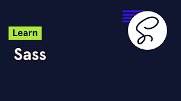

#          Bionic Team

# RoadMap-Front-End-Circle-
### This Road Map for all levels in front-end circle
# Beginner Level:-
### 1- html5
### 
## References:-
### 1- Arabic:-
[click-here](https://www.youtube.com/watch?v=6QAELgirvjs&list=PLDoPjvoNmBAw_t_XWUFbBX-c9MafPk9ji&pp=iAQB).
### 2- English:-
[chose the first video in list](https://www.youtube.com/watch?v=kUMe1FH4CHE&list=PLWKjhJtqVAbnSe1qUNMG7AbPmjIG54u88).
### 3- Research:-
[click-here](https://www.w3schools.com/html/default.asp).
### 4- Assignments:-
## (سيتم اعطاؤها خلال الاسبوع من ال head-supervisor) 
### 2- css3
### 
## References:-
### 1- Arabic:-
[click-here](https://www.youtube.com/playlist?list=PLDoPjvoNmBAzjsz06gkzlSrlev53MGIKe).
### 2- English:-
[click-here](https://www.youtube.com/watch?v=pmKyG3NBY_k&list=PLWKjhJtqVAbl1AfjiGyYxwpdAPi5v-1OU).
### 3- Research:-
[click-here](https://www.w3schools.com/html/html_css.asp).
### 4- Assignments:-
## (سيتم اعطاؤها خلال الاسبوع من ال head-supervisor)
## 

## Ending of Beginner Level:-
### Projects:-
##### . [first-project](https://www.youtube.com/watch?v=7_USXxmn7DM&list=PLDoPjvoNmBAy1l-2A21ng3gxEyocruT0t).
##### . [second-project](https://www.youtube.com/watch?v=hlwlM4a5rxg).
##### . [third-project](https://www.youtube.com/watch?v=ZGEJiprL6Ew).

# Intermediate Level
### 1- Sass
### 
## References:-
### 1- Arabic:-
[click-here](https://www.youtube.com/watch?v=Di_RlcpkpN4&list=PLDoPjvoNmBAzlpyFHOaB3b-eubmF0TAV2).
### 2- Research:-
[click-here](https://www.w3schools.com/sass/).

## (سيتم اعطاؤها خلال الاسبوع من ال head-supervisor)
### 2- tailwindCss
### 
## References:-
### 1- English:-
[click-here](https://youtu.be/pYaamz6AyvU?si=ZHCXhogNigCh7IbR).
### 2- Research:-
[click-here](https://tailwindcss.com/).
## (سيتم اعطاؤها خلال الاسبوع من ال head-supervisor)
### 3- Projects:-
[Project with tailwind](https://youtu.be/xpGNcQDmV2A?si=gO8-cMIo4P1OVhgs)

### (1-2-3)- JavaScript
### 
## References:-
### 1- Arabic
[Learn](https://www.youtube.com/watch?v=GM6dQBmc-Xg&list=PLDoPjvoNmBAx3kiplQR_oeDqLDBUDYwVv)
### 2- Research
[Search](https://www.w3schools.com/js/).

### 2- Problem Solving:-
[https://www.codewars.com/]
[https://leetcode.com/]
# Advanced Level:-
### 1- Git-GitHub:-
### 
### References:-
[Learn](https://www.youtube.com/watch?v=ACOiGZoqC8w&list=PLDoPjvoNmBAw4eOj58MZPakHjaO3frVMF).

## (سيتم اعطاؤها خلال الاسبوع من ال head-supervisor)
### 2- Problem Solving:-
[https://www.codewars.com/]
[https://leetcode.com/]
### 3- Projects:-
###### . Dynamic website with js.
###### . Slider
###### . TODO

### 4- Study Hard JavaScript:-
#### What is the event loop 
#### OOP
#### Promise Vs Fetch
## (في هذه المرحلة انت قد وصلت الي مرحله متقدمه جدا جدا بفضل الله ممكن تتعلم حاجات اضافيه في المرحله دي TypeScript + Next.js)
#### 

# End Of Circle:-

## (في هذه المرحلة انت ليك كامل الحريه في اختيار ال frameworkوان شاء الله فريق العمل هيقول وقتها المصادر اللي تقدر تذاكر منها)
### 5-React
### 5-Angular
### 5-Vue
